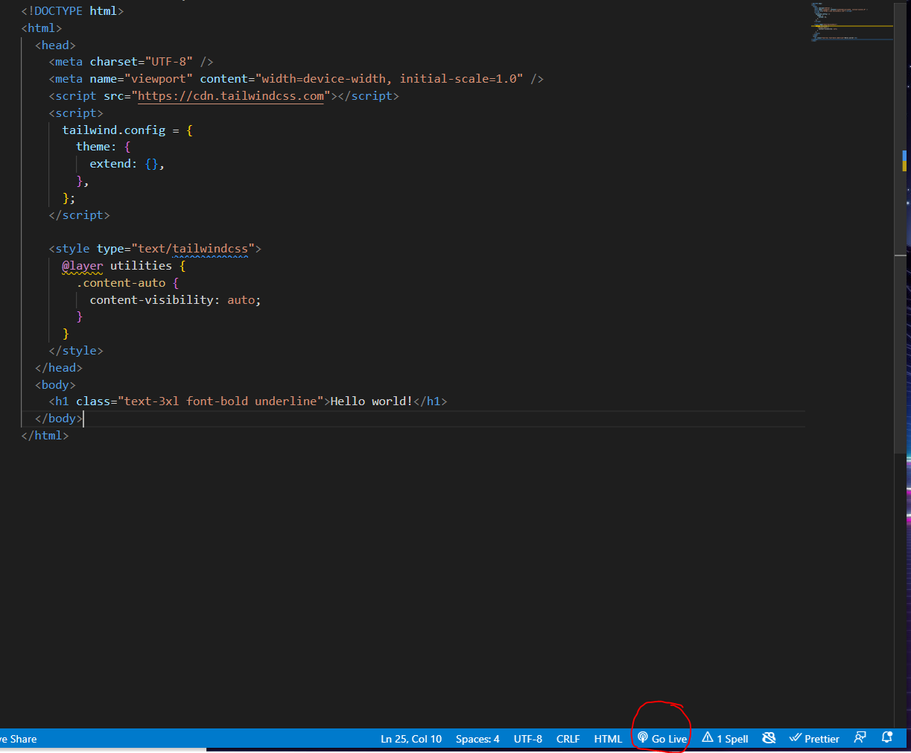

# CISC288-TailwindStarter

This repository is to set you up with tailwind and begin learning to develop locally using basic NodeJS tools.

Ensure that you have VSCode and git already installed on your computer. In addition, please install the following VSCode extensions:

* [Tailwind CSS](https://marketplace.visualstudio.com/items?itemName=bradlc.vscode-tailwindcss)
* [Tailwind Docs](https://marketplace.visualstudio.com/items?itemName=austenc.tailwind-docs)
* [Live Server](https://marketplace.visualstudio.com/items?itemName=ritwickdey.LiveServer)
* [Prettier](https://marketplace.visualstudio.com/items?itemName=esbenp.prettier-vscode)

## How to use

Open up the `src/index.html` file.  Click the "Go Live" button at the **bottom** of vscode. This will start a websever. Now anytime you edit the html file, the sever will 

## Lesson

### Layout and Sizing

Follow along in `basic-sizing-typography.html`.

* Container - `container mx-auto`
* Sizing 
    * Width - `w-1`, `w-32`, `w-1/2`
    * Height - `h-1`, `h-32`, `h-screen`, `h-full`
* Margin
    * Top - `mt-6`
    * Bottom - `mb-6`
    * Left - `ml-6`
    * Right - `mr-6`
* Padding
    * Top - `pt-6`
    * Bottom - `pb-6`
    * Left - `pl-6`
    * Right - `pr-6`
* Columns - `columns-2`, `columns-md`

#### Typography

* Font Family - `font-sans`, `font-serif`, `font-mono`
* Font Size - `text-xs`, `text-sm`, `text-base`, `test-lg`, `text-xl`, `text-2xl`, etc.
* Font Weight -  `font-thin`, `font-normal`, `font-semibold`, `font-bold`
* Text Align - `text-left`, `text-center`, `text-right`
* Text Color - `text-slate-500`

#### Flex 

Follow along in `flex.html`

#### Grid

Follow along in `grid.html`

### Borders

Follow along on `borders.html`

* Border Radius
* Border Width
* Border Color
* Box Shadow
* Box Shadow Color

### Handling Hover States

https://tailwindcss.com/docs/hover-focus-and-other-states 

* Transitions
    * Transition Property -  `hover:`
    * Transition Duration

## Useful Websites

* [Tailwindshades](https://www.tailwindshades.com/) - Customize a pallette for your brand identity
